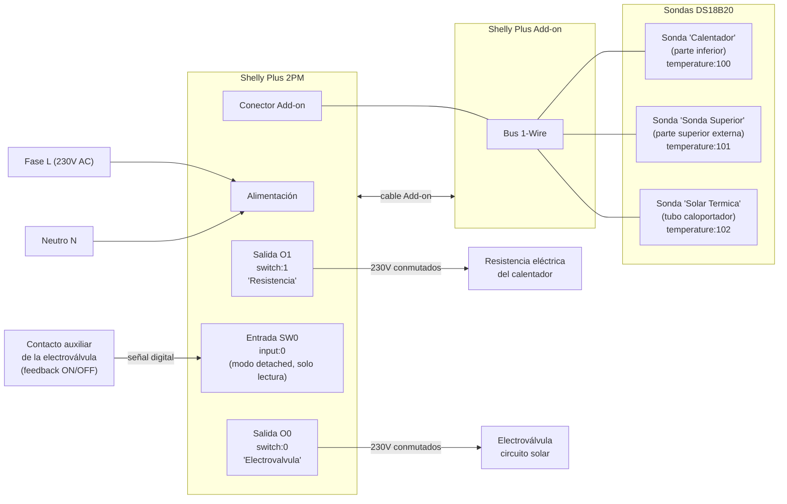

# Diseño

```mermaid
flowchart LR
  L["Fase L (230V AC)"]
  N["Neutro N"]

  subgraph PLUS2PM["Shelly Plus 2PM"]
    direction TB
    PWR["Alimentación"]
    O0["Salida O0<br/>switch:0<br/>'Electrovalvula'"]
    O1["Salida O1<br/>switch:1<br/>'Resistencia'"]
    I0["Entrada SW0<br/>input:0<br/>(modo detached, solo lectura)"]
    ADDCONN["Conector Add-on"]
  end

  subgraph ADDON["Shelly Plus Add-on"]
    direction TB
    OW["Bus 1-Wire"]
  end

  subgraph SONDAS["Sondas DS18B20"]
    S1["Sonda 'Calentador'<br/>(parte inferior)<br/>temperature:100"]
    S2["Sonda 'Sonda Superior'<br/>(parte superior externa)<br/>temperature:101"]
    S3["Sonda 'Solar Termica'<br/>(tubo caloportador)<br/>temperature:102"]
  end

  RES["Resistencia eléctrica<br/>del calentador"]
  EV["Electroválvula<br/>circuito solar"]
  AUX["Contacto auxiliar<br/>de la electroválvula<br/>(feedback ON/OFF)"]

  L --> PWR
  N --> PWR

  PLUS2PM <-- "cable Add-on" --> ADDON
  ADDCONN --- OW
  OW --- S1
  OW --- S2
  OW --- S3

  O1 -- "230V conmutados" --> RES
  O0 -- "230V conmutados" --> EV
  AUX -- "señal digital" --> I0

```
